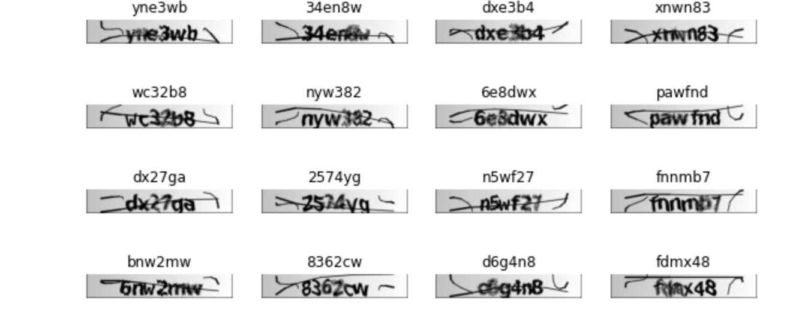

# Captcha Recognition Dataset/Model and automation

This project presents a custom Captcha dataset and deep learning model for Captcha recognition, along with a script to automate appointment systems using the trained model.

## Key Contributions

- A custom Captcha dataset with 6 characters per captcha
- A deep learning model for Captcha recognition
- Deployment of the model to read Captchas and automate appointment systems

## Requirements

1. Install Chrome using the provided `installchrome.sh` script.
2. Install a compatible Chrome driver. A driver is included in the repository, but if it is incompatible, download and install the appropriate version.
3. Install the required packages using: `pip install -r requirements.txt`.

## Dataset

You can download the 5 digit Captcha dataset from link below 

Few examples of the dataset are shown below

  
&nbsp; &nbsp; &nbsp; &nbsp;
  

  
&nbsp; &nbsp; &nbsp; &nbsp;
  

  
&nbsp; &nbsp; &nbsp; &nbsp;
  

After training on 5 digit dataset we further finetune the model on 6 digit Captcha dataset

  

Datasets and trained models for (6 char captcha) can be downloaded from below

https://drive.google.com/drive/folders/1NS9CBTT-bu7Uegc6t2jn3Xg3m8iUtsZz?usp=share_link

## Model Training

Refer to the `train_captcha.ipynb` notebook for instructions on training the Captcha recognition model with the provided dataset. The model architecture utilizes two bidirectional LSTMs and CTC loss for Captcha recognition. It has low latency and demonstrates high accuracy in online tests.

## Automatic Appointment System

The `automation.py` script leverages the trained Captcha recognition model to identify Captchas on websites and verify the availability of appointments. If an appointment is available, it sends an email notification to the specified recipient. While the automation is tailored to a specific type of website, it can serve as a blueprint for creating appointment or alert systems for other websites and services.

